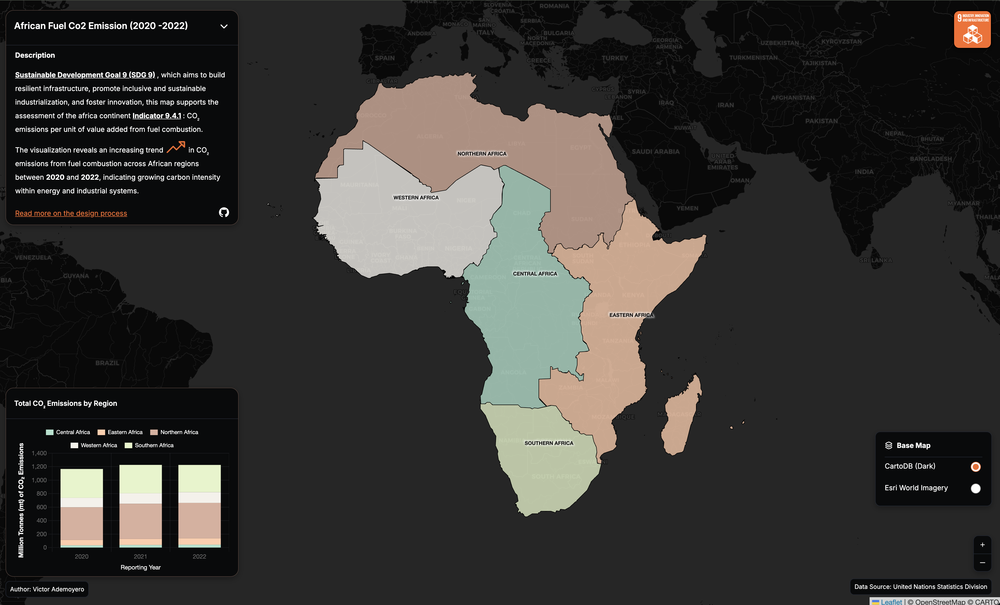

# Africa Fuel Co2 Emission (2020 - 2022)

## Overview
This web map visualizes the CO₂ emissions per unit of value added from fuel combustion across the African continent for the years 2020, 2021, and 2022. The map provides an interactive platform for users to explore regional patterns and temporal changes in carbon intensity within Africa’s energy and industrial systems.

## Table of Contents

- [Background](#background)
- [Features](#features)
- [Usage](#usage)
- [Tool Used](#tool-used)
- [Design Process](#design-process)
- [Author](#author)
- [Instructor](#instructor)
- [License](#license)

## Background

This web map aligns with **Sustainable Development Goal 9 (SDG 9)**, which focuses on building resilient infrastructure, promoting inclusive and sustainable industrialization, and fostering innovation. It supports the assessment of **Indicator 9.4.1** by visualizing **CO₂ emissions per unit of value added from fuel combustion** across the African continent. By presenting regional patterns and temporal change, the map highlights how carbon intensity within Africa’s energy and industrial systems has evolved. The visualization reveals a clear **increasing trend in CO₂ emissions between 2020 and 2022**, underscoring growing environmental pressures and the need for cleaner, more efficient industrial and energy practices.

## Features

- **Interactive Map**: Users can explore CO₂ emissions across different African regions, with the ability to zoom in and out.
- **Temporal Analysis**: The map allows users to compare CO₂ emissions over the years 2020, 2021, and 2022, highlighting trends and changes in emissions.
- **Data Visualization**: Emissions are displayed using charts with corresponding color, making it easy to identify regions with higher or lower emissions across years.
- **Informative Tooltips**: Hovering over specific regions provides detailed information about the CO₂ emissions for that area, including exact values and percentage changes over time.
- **Base Map**: The map uses a base layer that provides geographical context, allowing users to easily identify countries and regions within Africa.

## Usage

To use the web map, follow these steps:
1. Open the web map in a compatible web browser.
2. Use the zoom controls to navigate to different regions of Africa.
3. Click on specific regions to view detailed information about CO₂ emissions for the years 2020, 2021, and 2022.
4. Observe the color-coded emissions data to identify trends and patterns across the continent.
5. Use the provided charts to compare emissions data over the three-year period and analyze the changes in CO₂ emissions across different regions.

## Tool Used:
- **Leaflet.js**: For creating the interactive web map and handling map layers and user interactions.
- **D3.js**: For creating dynamic and interactive data visualizations, such as charts and graphs, to represent CO₂ emissions data effectively.
- **GeoJSON**: For storing and representing geographical features and associated data, allowing for easy integration with Leaflet.js to display emissions data on the map.

## Design Process
1. **Data Collection**: Gathered CO₂ emissions data from reliable sources, ensuring it was accurate and up-to-date for the years 2020, 2021, and 2022.
2. **Data Processing**: Cleaned and processed the data to ensure it was in a format suitable for visualization, including calculating emissions per unit of value added and categorizing data by region.
3. **Map Design**: Using the Static Map Design principle after user testing was conducted, I designed a clear and intuitive web map layout that effectively communicates the emissions data while allowing for easy navigation and interaction. Design process can be found in the [Design Process](https://storymaps.arcgis.com/stories/cb328f07987a4dc1aff24b88d31095fc)

## Author

Victor Ademoyero
[victor.ademoyer@stud.plus.ac.at]

## Instructor

Dr. Keskin Merve
[merve.keskin@plus.ac.at]

## License

This project is created for Advanced Cartography(856.282) Final Project Submission.
